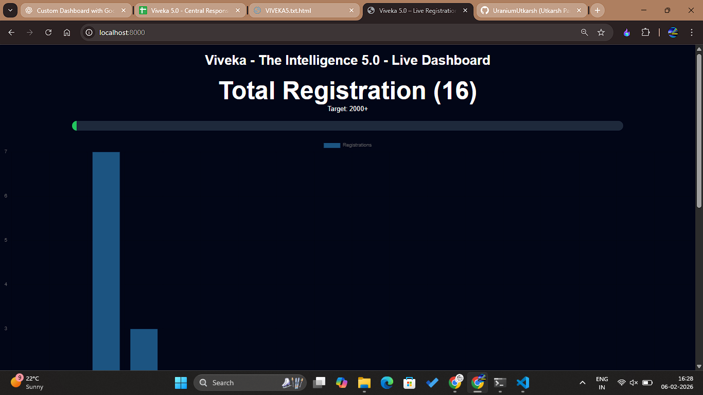
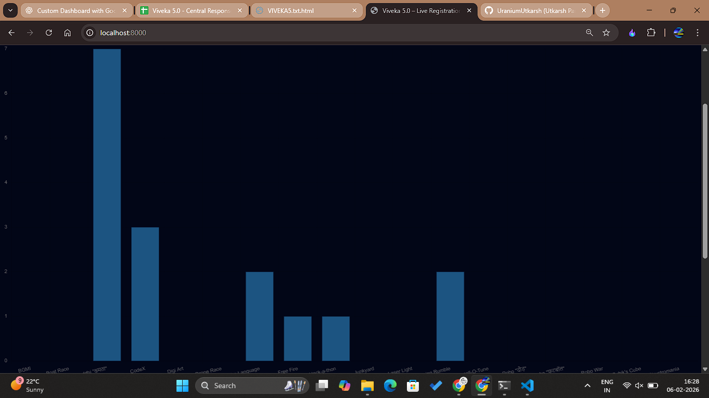
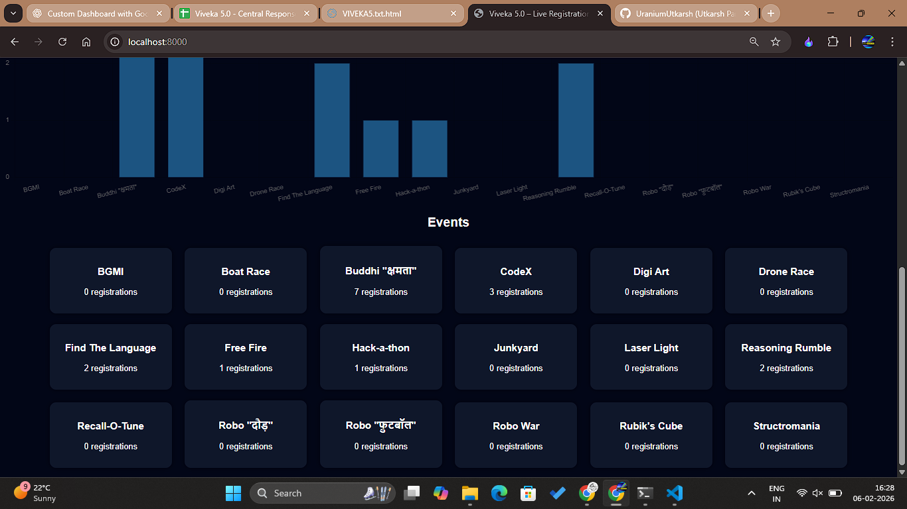
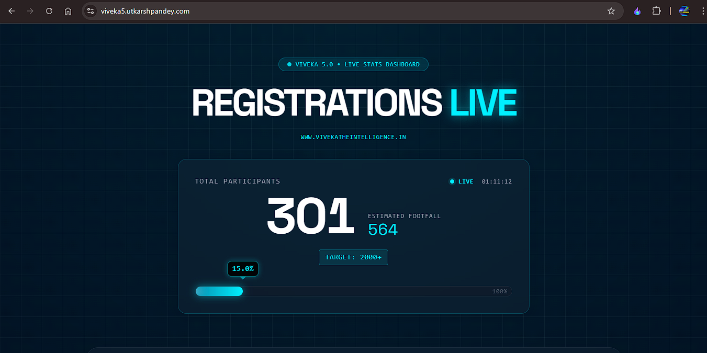
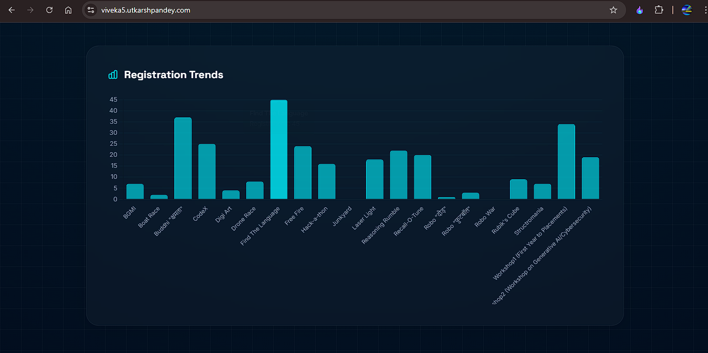
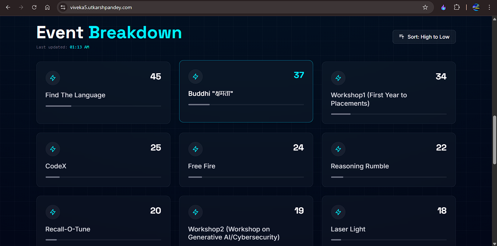

# Viveka5 – Live Dashboard

A real-time **Live Monitoring Dashboard** built for the **Viveka – The Intelligence 5.0 - Techfest 2026** core team to track **participations and footfall** efficiently during the event.

This dashboard helps organizers make quick, data-backed decisions while the fest is live.

---

## About the Project

The **Viveka5 Live Dashboard** was initially developed with a functional, minimal UI focused on core logic and live data handling.  
Later, a contributor joined the project and significantly enhanced the **styling and visual presentation**, improving usability and overall experience.

---

## Purpose

- Monitor **live events & workshops**
- Track **participant registrations & footfall**
- Provide **instant visibility** to the core organizing team
- Reduce dependency on manual counts and spreadsheets

---

## 🌐 Official Event Website

🔗 **https://www.vivekatheintelligence.in**
Built by [Shrinjay Shresth](https://github.com/shrinjayshresth1)

---

## 🖥️ Dashboard Versions

### 🔸 Previous Version (Initial Build)
*(Functional, logic-focused UI)*

📸 **Screenshot Placeholder**

---

### 🔸 Current Version (Styled & Improved)
*(Enhanced UI/UX contributed by a collaborator)*

📸 **Screenshot Placeholder**

---

## Features

- Live participation count
- Real-time footfall tracking
- Web-based dashboard (accessible on any device)
- Clean and responsive UI
- Designed specifically for **event operations**

---

## Contributions

This project evolved with collaborative effort:
- Initial structure and logic by the repository owner
- UI & styling improvements by a [Praveen](https://github.com/webdevpraveen)

Contributions are welcome via pull requests.

---

## Tech Stack

- HTML
- CSS
- JavaScript
- Google Sheets (as live data source)
- Deployed on web for real-time access

---

## 📜 License

This project is built exclusively for **Viveka – The Intelligence 5.0 - Techfest 2026** and its organizing team.

---

⭐ If this dashboard helped streamline event operations, consider starring the repository.